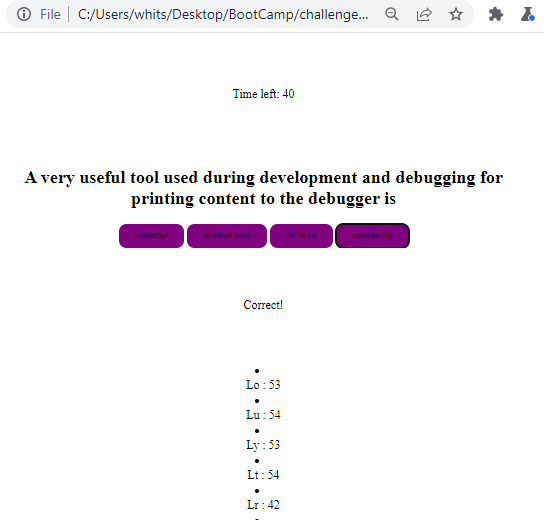

# challenge-04-code-quiz
Hello! This repository contains the code I created for the fourth challenge:
Code Quiz.
I worked with HTML, CSS and Javascript to build this solution.
You will find comments in all three files.
Here is the link to the deployed application:
https://whitspa.github.io/challenge-04-code-quiz/

And here is the link to the repository:
https://github.com/whitspa/challenge-04-code-quiz.git

My github repository is published under the MIT license
and I can be reached via email at: whitspa64@gmail.com
with any questions.

I ran out out of time debugging a more streamlined algorithm
for the display question function and would welcome your feed
back on where I can fix it. You can find it in my javscript 
code lines 214-233.

A screen shot of the deployed application is below

